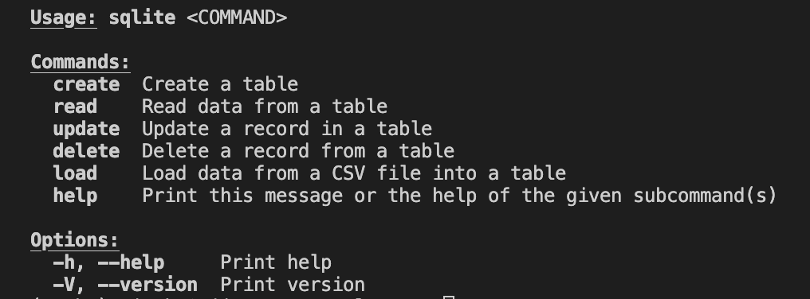

Check CI/CD Status: 

# Mini-project #7
#### Repo Title: Package a Python Script into Rust
#### Author: Seijung Kim (sk591)

## Overview
This project aims to package a simple Python program into a Rust-based Command Line Interface (CLI) that the user can install and use. This command line tool built with Rust allows manipulating an SQLite database. Using this tool you can load raw data from a csv and perform CRUD queries on the stored data. The project demonstrates a complete CI/CD pipeline with GitHub Actions. A pre-built binary artifact is available through the GitHub Actions workflow, which can be downloaded from the GitHub Actions Artifacts. For details about how to use the tool, follow the `User Guide` in this README.

## Requirements
* Package a Python script with setuptools or a similar tool
* Include a user guide on how to install and use the tool
* Include communication with an external or internal database (SQLite)
* Provide the binary file as an artifact in CI/CD

# User Guide
The project includes the files below:

* `.devcontainer` (with `.devcontainer.json` and `Dockerfile`)
* `.github/workflows` for GitHub Actions that integrates Rust CICD workflow and generates a binary artifact you can execute as CLI.
* the `data` folder has the Titanic 
* In the sqlite folder, you will see the 
* In `test_main.py`, we check if all ETL and SQL queries have ran successfully.
* In `mylib`, there are three scripts:
`extract.py`: extracts a dataset from a URL.
`query.py`: contains functions including join, aggregation, and sorting query operations.
`transform_load.py`: loads the transformed data into a Databricks warehouse table using Python's SQL module.

### How to Use

1. First, make sure you have the following prerequisites:
* Set up your Rust environment. Verify your installation using `cargo --version` or use the rustup tool to install Rust with `curl --proto '=https' --tlsv1.2 -sSf https://sh.rustup.rs | sh`.
* Have this repostiory cloned into your local machine using `git clone <repository_url>`.
2. Fetch the required dependencies and libraries.

```bash
cargo add clap --features derive
cargo add rusqlite
cargo add csv
```

3. Navigate to the root project directory and build the project's binary executable by running the `cargo build --release` command. This will compile the project and create a release version of the binary executable in the target/release directory.
4. Navigate to the sqlite/target/release directory and run the binary executable using available commands (such as create, read, update, etc.). You can run `./sqlite --help` to view the list of commands. Please go to the CLI Commands section of this README to view the full range of available commands and options.

### CLI Commands
Please refer to the following table to find all the commands you can execute with this CLI tool.



| **Command** | **Description** | **Generic Form** |
|-------------|-----------------|---------------------|
| `create`    | Creates a table in the database | `./sqlite create --table_name <table_name>` |
| `read`      | Executes a SQL query on a table | `./sqlite read --query "<sql_query>"` |
| `update`    | Updates a specific record in a table | `./sqlite update --table_name <table_name> --id <id> --name <name> --age <age>` |
| `delete`    | Deletes a specific record from a table | `./sqlite delete --table_name <table_name> --id <id>` |
| `load`      | Loads data from a CSV file into a table | `./sqlite load --table_name <table_name> --file_path <file_path>` |

### Test with users.csv
Theoretically this CLI tool can be configured to work with any CSV file, but the current CRUD operations and queries are set to work with users.csv, a simple dataset generated for this project.

* Data schema:
| Column               | Data Type |
|----------------------|-----------|
| `user_id`            | INTEGER   |
| `age`                | INTEGER   |
| `salary`             | INTEGER   |
| `years_of_experience`| INTEGER   |
